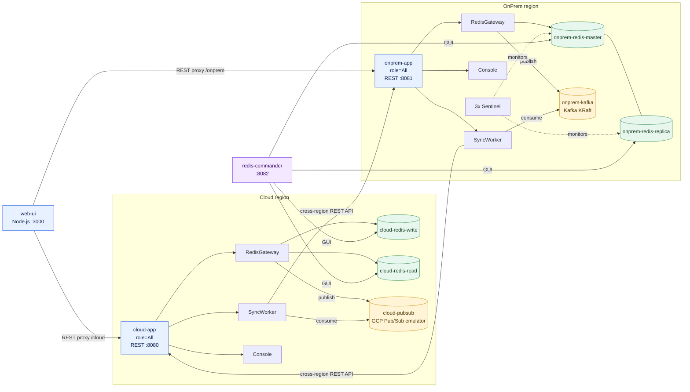

# camellia-sync — 雲地 Redis 資料同步 demo

以 [NetEase Camellia](https://github.com/netease-im/camellia)（Redis proxy）為核心的雲端 ⇄ 地端
（Cloud ⇄ OnPrem）Redis 資料同步示範專案。單一 Spring Boot 程式，透過啟動參數切換不同 **role**、
不同 **message queue** 方案、不同 **位置定位**，並附 Node.js Web UI 做「操作 + 檢查」的 demo 介面。

## 架構

```
        ┌───────────────────────────── Cloud ─────────────────────────────┐
        │  cloud-app (role=All)                                           │
        │   ├─ RedisGateway  → 主寫 cloud-redis  + 發佈 cloud-pubsub        │
        │   ├─ SyncWorker    → 消費 cloud-pubsub → 叫用 onprem-app REST API │
        │   └─ Console       → REST API (:8080)                           │
        │  後端: cloud-redis-write / cloud-redis-read (ReadWrite 讀寫分離)    │
        └──────────────────────────────┬──────────────────────────────────┘
                                        │  (跨區叫用 API: POST /api/replay)
        ┌──────────────────────────────┴──────────────────────────────────┐
        │  onprem-app (role=All)                                          │
        │   ├─ RedisGateway  → 主寫 onprem-redis + 發佈 onprem-kafka        │
        │   ├─ SyncWorker    → 消費 onprem-kafka → 叫用 cloud-app REST API  │
        │   └─ Console       → REST API (:8081)                           │
        │  後端: onprem-redis master/replica + 3×sentinel (Sentinel 模式)    │
        └─────────────────────────────────────────────────────────────────┘
                                        │
                                 web-ui (Node) :3000
                                 redis-commander  :8082
```

以下 Mermaid 圖提供可在 GitHub Markdown 直接渲染的系統架構視圖：



### 設計要點

- **雙活 (active-active)**：兩區各自主寫本地 Redis，並把變更發佈到本地出站佇列；SyncWorker 消費本地出站佇列後，跨區叫用對端 REST API (`/api/replay`) 重放至對端 Redis，達成雙向同步。
- **防 Ping-Pong 迴圈**：重放時透過 `GlobalRedisProxyEnv.getClientTemplateFactory()` 直連 Upstream Redis，**繞過** ProxyPlugin，確保重放寫入不再觸發出站佇列，斷絕 A→B→A 無窮迴圈。
- **HTTP 連線池 + Retry**：跨區 REST API 呼叫使用 Apache HttpClient 5 的 `PoolingHttpClientConnectionManager`（maxTotal=50, maxPerRoute=20, TTL=60s），並對 IOException / 5xx 做最多 3 次指數退避重試（100ms → 200ms → 400ms）。
- **Key 過濾（skipRegExp）**：Consumer Plugin 支援透過正則式排除特定 key 的重放，避免冪等鍵或系統鍵被無謂同步。
- **每 region 一個出站佇列、跨區 API 消費**：Cloud 出站與消費用 **GcpPubSub**、OnPrem 出站與消費用 **Kafka**，同時示範兩種 message queue 方案。
- **單一 jar 多 role**：`APP_ROLE` 切換 `RedisGateway | SyncWorker | Console | All`。
- **Camellia 擴充點掛接**（不重寫核心）：
  - `MqPackSender`（出站發送）×3 → `GcpPubSubMqPackSender` / `RedisPubSubMqPackSender` / `KafkaMqPackSender`
  - `ProxyPlugin`（入站消費）×3 → `GcpPubSubConsumerProxyPlugin` / `RedisPubSubConsumerProxyPlugin` / `KafkaConsumerProxyPlugin`
  - `RouteConfProvider` → `RedisModeRouteConfProvider`（Single / Sentinel / ReadWrite）
  - `ConsoleService` → `SyncConsoleService`（自訂 `/custom` 輸出 MQ 指標）

## 模組結構

```
camellia-sync/
├── sync-common/   共用模型(enum) + 設定(AppProperties/SyncProperties) + 指標(QueueMetrics)
├── sync-proxy/    Camellia 擴充點實作：3×sender、3×consumer plugin、RouteConfProvider、ConsoleService
│                  MqPackReplayer（跨區 HTTP 重放，含連線池 + Retry）
├── sync-app/      Spring Boot 主程式 + REST API + role/queue 注入(SyncEnvironmentPostProcessor)
├── web-ui/        Node.js (Vite + React + Express) 前端，反代 /cloud、/onprem
├── test-script/   端到端功能測試（shell）+ 壓力測試（Python）
├── Dockerfile     multi-stage：Maven 25 建置 → temurin 25-jre
└── docker-compose.yml
```

## 快速啟動

```bash
docker compose up -d --build
```

| 服務 | 位址 | 說明 |
|---|---|---|
| web-ui | http://localhost:3000 | 操作 + 檢查介面 |
| redis-commander | http://localhost:8082 | Redis 內容可視化 GUI（預設已連線兩端 Redis 與 Proxy） |
| cloud-app | http://localhost:8080 | Cloud region REST API（Redis proxy :6380、console :16379） |
| onprem-app | http://localhost:8086 | OnPrem region REST API（容器內 8081，宿主映射 8086；Redis proxy :6381、console :16380） |
| onprem-kafka | localhost:9092 | 地端出站佇列（KRaft） |
| cloud-pubsub | localhost:8085 | 雲端出站佇列（GCP Pub/Sub emulator） |
| cloud-redis-write/read | localhost:6401 / 6402 | 雲端 Memorystore 模擬（讀寫分離） |
| onprem-redis-master/replica | localhost:6403 / 6404 | 地端 master/replica（sentinel 監控 mymaster） |

> 埠注意：宿主若已有其他服務佔用 8080/8081 等，請改 `docker-compose.yml` 的宿主映射。
> 本 repo 已將 onprem-app 宿主映射設為 **8086**（避開既有 session 服務的 8081）。

## 端到端測試

Stack 啟動後，可使用 `test-script/` 下的 REST API 測試腳本驗證健康狀態、雙向同步、TTL、大小網切換防抖、佇列指標與 Web UI：

```bash
cd test-script
./run-all.sh
```

也可以單獨執行某一項測試，例如：

```bash
./test-02-cloud-to-onprem.sh   # Cloud → OnPrem 雙向同步
./test-08-hash-zset.sh         # Hash / SortedSet 操作與同步
```

### 壓力測試（test-09-volume.py）

使用多 Process × 多 Thread × Redis pipeline 的極限 TPS 壓測工具，測試各目標 Redis 的最大吞吐量。

```bash
# 需先安裝 redis-py
pip3 install redis

# 測試 onprem-master（預設）
python3 test-script/test-09-volume.py

# 測試其他目標
python3 test-script/test-09-volume.py --target cloud
python3 test-script/test-09-volume.py --target onprem-proxy   # 含 Camellia + Kafka
python3 test-script/test-09-volume.py --target cloud-proxy    # 含 Camellia + GCP Pub/Sub

# 四個目標全測
for target in onprem cloud onprem-proxy cloud-proxy; do
  python3 test-script/test-09-volume.py --target $target
done
```

#### 實測 TPS（本機：Apple M 系列，11 核，88 連線，Pipeline=200）

| 目標 | 架構 | SET TPS | HSET TPS | ZADD TPS | 峰值 TPS |
|------|------|--------:|---------:|---------:|---------:|
| onprem-master（直連） | Redis 直連 | ~715k | ~853k | ~715k | **853k** |
| cloud-write（直連） | Redis 直連 | ~733k | ~822k | ~719k | **822k** |
| onprem-proxy | Camellia + Kafka | ~359k | ~350k | ~342k | **359k** |
| cloud-proxy | Camellia + GCP Pub/Sub emulator | ~2.5k | ~1.6k | ~1.3k | **2.5k** |

> **說明**：
> - 直連 Redis：~800k TPS，Redis 本身效能極佳。
> - Camellia + Kafka（onprem-proxy）：~350-360k TPS，Kafka 同步帶來約 -58% 開銷，生產環境可接受。
> - Camellia + GCP Pub/Sub emulator（cloud-proxy）：~2k TPS，**受限於 emulator 的 HTTP/gRPC 延遲，不代表生產 GCP Pub/Sub 實際吞吐**（生產環境估計 50k-100k TPS）。

完整測試清單、環境變數與執行行為請參考 [`test-script/README.md`](test-script/README.md)。

## 組態參數（env）

| 環境變數 | 預設 | 說明 |
|---|---|---|
| `APP_ROLE` | `All` | `RedisGateway` / `SyncWorker` / `Console` / `All` |
| `APP_LOCATION` | `Cloud` | `Cloud` / `OnPrem`（寫入 envelope 的 origin） |
| `SYNC_QUEUE_TYPE` | `Kafka` | 佇列方案 `GcpPubSub` / `RedisPubSub` / `Kafka` |
| `SYNC_REMOTE_APP_URL` | — | 遠端 App API 位址（跨區 REST API 重放目標，如 `http://onprem-app:8081`） |
| `SYNC_SKIP_REG_EXP` | — | 跳過重放的 key 正則式（如 `^sys:` 排除系統鍵） |
| `REDIS_MODE` | `Single` | `Single` / `Sentinel` / `ReadWrite` |
| `REDIS_PROXY_PORT` | `6380` | Camellia Redis proxy port |
| `PROXY_MAX_CLIENT_CONNECT` | `100` | Camellia Proxy 最大入站連線數 |
| `CONSOLE_PORT` | `16379` | Camellia console port |
| `QUEUE_TTL_SECONDS` | `30` | 佇列訊息 TTL |
| `SWITCH_MIN_INTERVAL_SECONDS` | `10` | 大小網切換防抖間隔 |
| `REDIS_SINGLE_HOST`/`PORT` | `127.0.0.1`/`6379` | Single 模式後端 |
| `REDIS_SENTINEL_NODES`/`MASTER` | — | Sentinel 模式（`host:port,...`） |
| `REDIS_READ_HOST`/`WRITE_HOST` | — | ReadWrite 模式（2 IP 讀寫分離） |
| `PUBSUB_HOST`/`PROJECT_ID`/`TOPIC`/`SUBSCRIPTION` | — | GCP Pub/Sub emulator 端點 |
| `KAFKA_BOOTSTRAP_SERVERS`/`TOPIC`/`GROUP_ID` | — | Kafka 端點 |

### Camellia Proxy 連線調優（application.yml）

Camellia 使用 Netty EventLoop multiplexing 架構，並非傳統連線池（每個 EventLoop 對每個 upstream Redis 節點維持持久 pipeline 連線）。主要可調參數：

| 參數 | 說明 | 建議值 |
|---|---|---|
| `proxy.max.client.connect` | 入站客戶端最大連線數（0=不限） | `1000`（中型場景） |
| `upstream.work.thread` | upstream Netty EventLoop 數（影響 upstream 並行）| `CPU 核心數 × 2` |
| `upstream.connect.timeout.millis` | upstream 連線建立超時（ms） | `1000` |
| `upstream.close.idle.connection` | 是否關閉 idle upstream 連線 | `true` |

## Redis 資料型別支援

Camellia Proxy 支援完整 Redis 命令集，包含：

| 型別 | 支援命令 | 說明 |
|---|---|---|
| **String** | `SET` / `GET` / `SETEX` / `DEL` / `EXPIRE` | 基本 KV、TTL 同步 |
| **Hash** | `HSET` / `HGET` / `HMSET` / `HGETALL` / `HDEL` | 欄位級寫入同步 |
| **Sorted Set** | `ZADD` / `ZRANGE` / `ZRANGEBYSCORE` / `ZREM` / `ZSCORE` | 分數排序同步 |
| **List** | `LPUSH` / `RPUSH` / `LRANGE` | 串列操作 |
| **Set** | `SADD` / `SMEMBERS` / `SREM` | 集合操作 |

## REST API

兩區同一組端點（Web UI 聚合兩端）：

| 方法 | 路徑 | 說明 |
|---|---|---|
| `POST` | `/api/session` | 寫入測試 session `{key, value, ttlSeconds?}`（TTL 走 SETEX） |
| `POST` | `/api/hash` | 寫入 Hash `{key, field, value}` |
| `POST` | `/api/zset` | 寫入 SortedSet `{key, member, score}` |
| `GET` | `/api/compare?key=` | 兩端一致性比對 + 延遲（回 value/origin/writtenAt/lagMs） |
| `GET` | `/api/switch` | 查詢目前 primary |
| `POST` | `/api/switch?to=Cloud\|OnPrem` | 大小網切換（10 秒防抖，過頻 429） |
| `GET`/`POST` | `/api/params` | 查詢 / 調整執行參數（queueTtlSeconds、minIntervalSeconds） |
| `GET` | `/api/queue-status` | 佇列積壓與消費狀態（sent/consumed/replaySuccess/replayFail/inFlight） |
| `POST` | `/api/replay` | 接收跨區 MqPack 並重放至本地 Upstream Redis（防迴圈設計） |
| `GET` | `/api/health` | 元件健康（role/location/queue types/redis mode） |

## 驗證結果

`docker compose up` 後各項端到端驗證：

1. **cloud→onprem**（GcpPubSub 出站）：cloud 寫入 → onprem `compare` 見 `origin=Cloud`。
2. **onprem→cloud**（Kafka 出站）：onprem 寫入 → cloud `compare` 見 `origin=OnPrem`。
3. **EXPIRE/SETEX 轉送**：TTL=8 的 key 兩端同步倒數、同步過期。
4. **大小網切換防抖**：10 秒內二次切換回 429。
5. **佇列指標**：兩端 `replayFail=0` 且 `sendFail=0`（零重放與發送失敗）。
6. **Hash / SortedSet 同步**：HSET / ZADD 寫入一端，另一端可讀出相同資料。
7. **web-ui**：:3000 HTTP 200。

## 技術棧

- **Java 25 + Spring Boot 3.5.9**（Maven 多模組）
- **Camellia 1.4.2**（`camellia-redis-proxy-spring-boot-starter` + `mq-common` + `mq-kafka`，內嵌 proxy）
- **Netty 4.2.10**（Camellia proxy 依賴，override Spring Boot 的 4.1）
- **Apache HttpClient 5**（跨區 REST replay：`PoolingHttpClientConnectionManager` 連線池 + 指數退避 Retry）
- **Jedis 5.2.0**（REST 寫入經 proxy 觸發同步）
- **Kafka 3.9.0**（`apache/kafka` KRaft 單節點）
- **GCP Pub/Sub emulator**（`google/cloud-sdk:emulators`）
- **Node.js 22 + Vite + React + Express**（web-ui，同源反代避免 CORS）
- **redis-commander**（Redis 可視化 GUI，預建立兩端 Redis + Proxy 連線）

## 備註

- Camellia 啟動時會 **eager preheat 上游 Redis 連線**，故 `docker compose` 中 app 依賴 Redis
  先行（`depends_on`），Redis 未就緒時 app 啟動會失敗。
- Redis 7.4 Sentinel 預設不解析 hostname（`resolve_hostnames=0` → `AI_NUMERICHOST`），故
  sentinel config 已加 `sentinel resolve-hostnames yes`。
- 雙向寫入衝突採 **LWW（last-write-wins）**，無衝突調解（按需求「忽略不一致」）。
- Camellia 的 `RedisConnectionHub` 使用 Netty EventLoop multiplexing，**不是傳統連線池**；
  `upstream.work.thread` 控制的是 EventLoop 數量（即持久 pipeline 連線數），而非連線池 slot 數。
- `MqPackReplayer.replay()` 使用 Apache HttpClient 5 連線池（RESP2 協議），相容 Camellia Proxy；
  redis-py 8.x 預設 RESP3（HELLO 命令），對 Camellia Proxy 需設 `protocol=2`。
